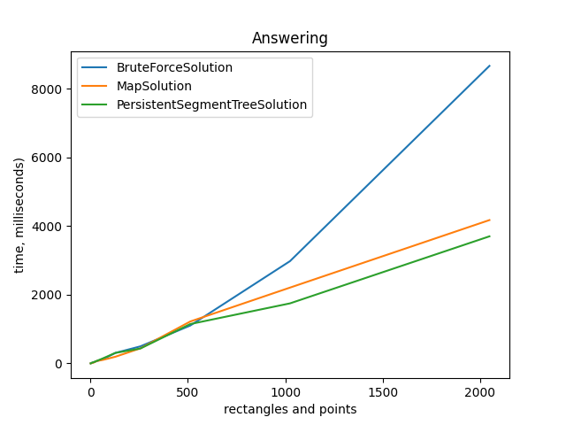

# Лабораторная работа №2
Выполнил Федоренко Артём 22ПИ2 avfedorenko_2@edu.hse.ru

Выполнено на Java 17 и python с библиотекой matplotlib для рисования графиков.

# Алгоритм полного перебора
В данном алгоритма отсутствует какая-либо подготовка данных перед ответом. При получении запроса происходит полный перебор всех прямоугольников. Для каждого проверяется принадлежит ли точка этому прямоугольнику.
Подготовка O(1), поиск O(N)
```java
public void prepareData(List<Rectangle> rectangles) {
    this.rectangles = rectangles;
}

public int getAnswer(Point point) {
    int count = 0;
    for (Rectangle r : rectangles) {
        if (point.x >= r.LB.x && point.x < r.RT.x && point.y >= r.LB.y && point.y < r.RT.y) {
            ++count;
        }
    }
    return count;
}
```
# Алгоритм на карте сжатых координат
Перед запросом осуществляется сжатие координат прямоугольников и построение сжатой карты координат. При получении запроса с помощью бинарного поиска по массивам сжатых координат каждой оси находится местоположение точки на сжатой карте координат. Там и находится ответ на запрос.
Подготовка O(N^3), поиск O(logN)
```java
public void prepareData(List<Rectangle> rectangles) {
    if (!rectangles.isEmpty()) {
        Set<Integer> setX = new HashSet<>();
        Set<Integer> setY = new HashSet<>();
        for (Rectangle r : rectangles) {
            setX.add(r.LB.x);
            setY.add(r.LB.y);
            setX.add(r.RT.x);
            setY.add(r.RT.y);
        }
        arrayX = setX.stream().sorted().toList();
        arrayY = setY.stream().sorted().toList();
        Map<Integer, Integer> coordsX = new HashMap<>();
        Map<Integer, Integer> coordsY = new HashMap<>();
        for (int x = 0; x < arrayX.size(); ++x) {
            coordsX.put(arrayX.get(x), x);
        }
        for (int y = 0; y < arrayY.size(); ++y) {
            coordsY.put(arrayY.get(y), y);
        }
        map = new int[arrayX.size()][arrayY.size()];
        for (Rectangle r : rectangles) {
            for (int x = coordsX.get(r.LB.x); x < coordsX.get(r.RT.x); ++x) {
                for (int y = coordsY.get(r.LB.y); y < coordsY.get(r.RT.y); ++y) {
                    ++map[x][y];
                }
            }
        }
    }
}

public int getAnswer(Point point) {
    int x = BinarySearch.search(point.x, arrayX);
    int y = BinarySearch.search(point.y, arrayY);
    if (x == -1 || y == -1) return 0;
    return map[x][y];
}
```
# Алгоритм на персистентном дереве отрезков
Подготовка данных в этом алгоритме состоит из сжатия координат прямоугольников и построение персистентного дерева отрезков. При получении запроса с помощью бинарного поиска по массивам сжатых координат каждой оси находится местоположение точки на сжатой карте прямоугольников, а затем находится ответ на запрос с помощью поиска по персистентному дереву отрезков.
Подготовка O(NlogN), поиск O(logN)
```java
public void prepareData(List<Rectangle> rectangles) {
    if (!rectangles.isEmpty()) {
        Set<Integer> setX = new HashSet<>();
        Set<Integer> setY = new HashSet<>();
        for (Rectangle r : rectangles) {
            setX.add(r.LB.x);
            setY.add(r.LB.y);
            setX.add(r.RT.x);
            setY.add(r.RT.y);
        }
        arrayX = setX.stream().sorted().toList();
        arrayY = setY.stream().sorted().toList();
        List<Event> events = new ArrayList<>();
        for (Rectangle r : rectangles) {
            events.add(new Event(BinarySearch.search(r.LB.x, arrayX), BinarySearch.search(r.LB.y, arrayY), BinarySearch.search(r.RT.y, arrayY), 1));
            events.add(new Event(BinarySearch.search(r.RT.x, arrayX), BinarySearch.search(r.LB.y, arrayY), BinarySearch.search(r.RT.y, arrayY), -1));
        }
        events.sort(Comparator.comparingInt(e -> e.x));
        tree = new PersistentSegmentTree(events, arrayY.size());
    }
}

public int getAnswer(Point point) {
    if (arrayX.isEmpty()) {
        return 0;
    }
    int compX = BinarySearch.search(point.x, arrayX);
    int compY = BinarySearch.search(point.y, arrayY);
    if (compX == -1 || compY == -1 || tree.nodes.size() <= compX) {
        return 0;
    }
    return tree.search(compX, compY);
}
```

# Сравнение алгоритмов
Медленнее всего подготовка данных происходит у алгоритма на карте, т.к. алгоритм подготовки имеет кубическую асимптотическую сложность из-за наличия вложенных циклов. Алгоритм подготовки данных на персистентном дереве отрезков быстрее алгоритма на карте, т.к. имеет асимптотическую сложность O(NlogN), что соответствует сложности построения дерева данного типа.


На графике видно, что особых отличий по времени ответа на запрос нет при количестве прямоугольников до примерно 512. При увеличении этой величины самым быстрым алгоритмом оказывается алгоритм на дереве с очень небольшим отрывом от алгоритма на карте, т.к. оба они имеют одинаковую асимптотику O(logN) алгоритма поиска ответа. Алгоритм полного перебора показывает худшее время, т.к. он проверяет каждый прямоугольник и соответственно имеет асимптотическую сложность O(N).



# Вывод
Самым худшим алгоритмом оказался полный перебор, т.к на маленьких данных показывает себя наравне с конкурентами, а на больших сильно проигрывает по времени работы. Среди оставшихся лучшим стал алгоритм на персистентном дереве отрезков. На больших данных он имеет как лучшее время подготовки, так и лучшее время ответа. При этом я данный алгоритм является самым сложным в реализации.
Для очень небольшого количества данных я бы выбрал алгоритм полного перебора, т.к. он самый простой в реализации и по времени работы не проигрывает конкурентам. Для более масштабных задач оптимальным является алгоритм на персистентном дереве отрезков.
